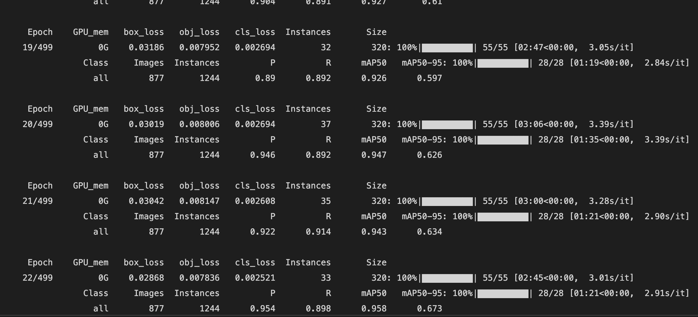
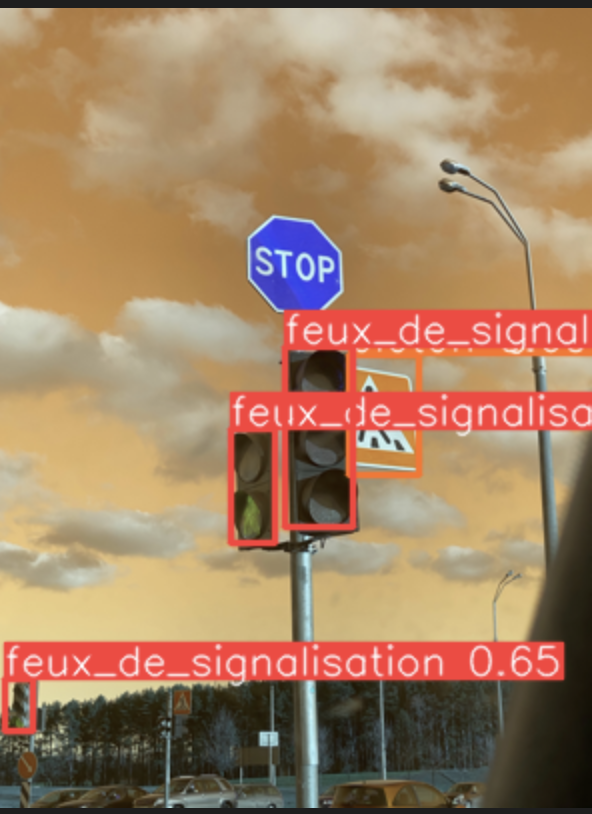

# Reconnaissance et Detection panneaux de signalisation
## Demo
Pour une simple demo executé `DemoYolo5.ipynb``
il ajoutera les datas et utilisera un model que j'ai entrainé.

--
L'ojectif de ce projet est d'utiliser YOLO5 qui est un model de reconnaissance utilisé dans les Tesla (a confirmer).
Nous aurons alors besoin d'utilisé.
Liste des fichier important :

- `MyModules/xmlGestion.py` contient les fonctions de conversion au format yolo
- `SignIA/setup.ipynb` qui execute toutes les étapes de la gestion des data (de leur  importation à manipulation)
- `SignIA/VOC.yaml` ce fichier configure l'entrainement d'un point de vue des datas, avec un nombre pour labelisé, la localisation des datas (entrainement et evaluation)
- `SignIA/yolo5.ipynb` qui va lui gerer ce qui conserne le model (de son importation a la realisation de son entrainement)
- `SignIA/Yolo5Sign.py `qui est sensé utilisé le model pour le tester sur des image random (a mettre sur streamlit ou fastapi)

> A noter que le README ne sera pas blindé d'information car le code est lui meme commenté. de + les datas et yolo5 ne seront pas dans le depot git afin de ne pas surcharger.

## Explication du processus réalisé

> Les etapes qui vont suivre nous informe sur le process utilisé afin de realiser le projet et si vous voulez de votre coter le reproduire.
### Recuperer les datas 

Comme enoncé plus haut pour recuperer les datas il faudra executer le `setup.ipynb`

> Les datas se trouve dans un drive

## YOLO5

Pour Yolo5 il va d'abords falloir récuperer le projet sur git, puis il faudra entrainner le model avec nos datas.
Pour que Yolo soit configurer avec nos datas il faut configuré le `VOC.yaml` qui labelise les datas.

Pour realisé cette étape il faudra excuté le `SignIA/yolo5.ipynb`

## Observation technique

Yolo étant déjà préconfigurer on peut personnaliser l'entrainement à notre guise.

Dans notre cas l'entrainement c'est effectué sur 22 epoch (22 cycle d'entrainement de 320 img) cela represente environ 1h30 de temps d'entrainement,  mais étant donnée que j'avais ~800 images à disposition je me suis rendu compte qu'il a forcement du voir les meme parfois. 
 
Mon yolo n'est pas optimal comme le demontre cette image

Pas tout les items on été detectés, et le pourcentage est de 60% de precision.

